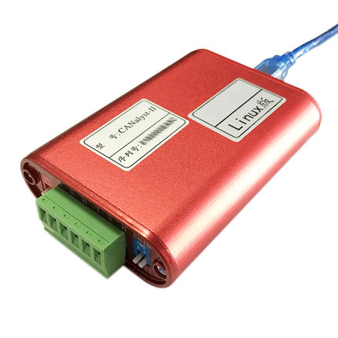

# New yellow golf control

This node is for new yellow golf control in SZ.

## Getting Started

ROS Kinetic.

### 1. Prerequisites

#### 1.1 USB-CAN Analyzer

##### 1.1.1 Config the Can Analyzer

1. `lsusb` and check the `PID::VID` of can analyzer . "04d8::0053" 
2. `cd /etc/udev/rules.d`
3. `sudo touch 99-canbus.rules`
4. `echo 'SUBSYSTEMS=="usb", ATTRS{idVendor}=="04d8", ATTRS{idProduct}=="0053", MODE="0666", SYMLINK+="canbus2"' > 99-canbus.rules`
5. `udevadm control --reload-rules && udevadm trigger`

#### 1.2 Can msg

`sudo apt-get install ros-<distro>-can-msg`

### 2. launch file

`roslaunch golf_new_control joystick_nodelet.launch`

### 3. usage

mode switch: "D" and "mode" led off 

move forewards or backwards: hold on right soft `RT` and push the left axe forwards or backwards.

steering left or right: hold on right soft `RT` and push the right axe left or right.

force stop: press the red button

clear map: press right button `RB`

active auto mode: press `back` and `start`

honk: press the left button `LB`
